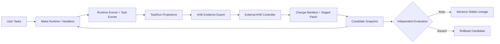
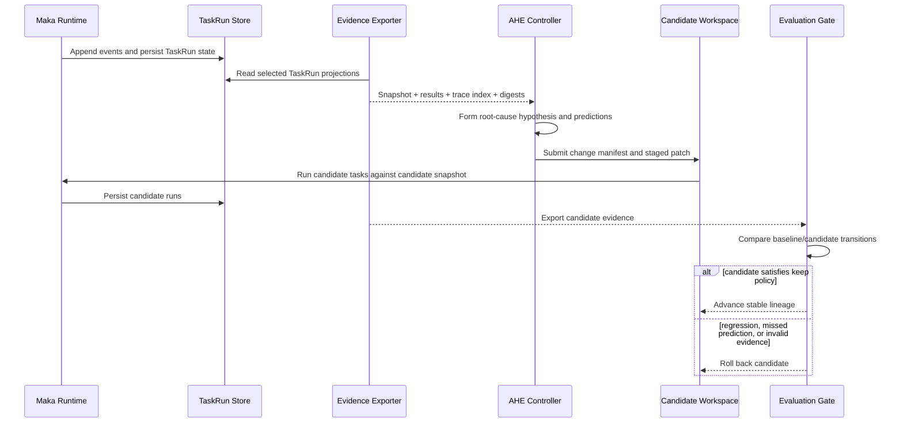

# Chapter 6: Self-Iteration Happens Outside the Runtime—Maka's AHE Evolution Boundary

> This chapter asks a larger question than Self-check: how can Maka learn from real runs and turn that experience into a better next version without letting the Agent handling a live task rewrite itself at will? Maka places self-iteration outside the interactive Runtime. Runtime produces unambiguous execution facts. AHE consumes an identified target snapshot and its evidence, proposes a constrained and falsifiable change manifest, and leaves an independent evaluation to decide whether the candidate earns a place in the stable lineage. **Event Log makes experience replayable; the AHE boundary makes change falsifiable.**

The chapter continues the first five chapters at a longer timescale. Runtime Event Log records one run. TaskRun projection organizes one durable task. Self-check provides bounded feedback inside that task. AHE observes a population of runs and attempts to change the system components that shape future runs.

It is written for Runtime, Headless, and evaluation engineers extending Maka's self-iteration capability. It covers the current AHE target protocol, evidence export, and source and patch guards. It also explains the adjacent implementation pattern demonstrated by the repository's Prompt Optimization Loop. It does not claim that Maka currently launches AHE itself, automatically applies arbitrary patches, or already provides an unattended general-purpose code-evolution system.

The chapter contains two lifecycle states:

- **Current**: Maka can declare a source-backed target surface, export authority-aware results, trace indexes, messages, and failure digests from TaskRun projections, and validate constrained change manifests;
- **Target**: an external AHE controller completes the snapshot, analysis, candidate patch, evaluation, acceptance, or rollback cycle and records a recoverable iteration lineage.

## From “this task failed” to “the next system should be different”

Suppose Maka runs ten durable tasks. Four fail in a similar place: the Agent understands the goal, but stops too early after a tool failure, while Self-check judges the incomplete result acceptable.

An ordinary Agent Run can attempt to repair the current task. A Self-check can point out gaps within a bounded number of Turns. The systemic question is different:

> Does this failure cluster mean that the system prompt, tool contract, context policy, or Headless policy itself should change?

Giving every trace to another model and allowing it to edit the repository immediately creates several problems:

- Which exact Maka version is it changing?
- Which files are editable control surfaces, and which are immutable evidence surfaces?
- Is “this fixes the problem” a narrative, or does it name failure cases and predictions?
- Did the candidate merely memorize the visible cases?
- Was the failure product behavior, evaluation infrastructure, or missing score authority?
- How does the system return to the previous stable lineage after no improvement or a regression?

The hard part of self-iteration is not generating a better prompt or patch. It is creating a trustworthy experimental boundary.

## The conclusion first: self-iteration is an outer loop, not Runtime recursion

Maka separates execution and evolution into two planes:

| Plane | Primary responsibility | Serves the current user Turn? |
|---|---|---|
| Runtime plane | Execute model and tool interactions; record events, permission decisions, artifacts, and task state | Yes |
| Evolution plane | Aggregate evidence across runs; propose candidates; compare baseline and candidate behavior | No |



Read the diagram left to right. The upper path turns real tasks into evolution evidence. The lower path sends a constrained change back through task execution and evaluation. AHE is intentionally outside Runtime: it does not participate in the live user conversation or inherit Runtime tool permissions.

This separation establishes an important property:

> Maka can let the system improve itself without asking the system under modification to be the fact recorder, change proposer, and final judge at the same time.

## Event Log becomes an experience substrate

Chapter 1 introduced Runtime Event Log as a replay substrate. Chapter 3 showed Compaction as a context projection over those facts. AHE gives the log a third use: it becomes experience that can be analyzed across tasks.

AHE should not ingest a pile of boundary-free JSONL directly. The current export first passes through TaskRun projection:

```text
Runtime / Task Events
        ↓ project
TaskRunProjection
        ↓ normalize and classify
Harness Results + Trace Index + Messages + Failure Digest
        ↓ bind to
Target Snapshot
```

Projection does not replace original facts. It provides stable task semantics such as final state, artifacts, Self-check, workspace observations, and score authority. When analysis needs more depth, `trace-index.json` can still point to `events.jsonl`, transcripts, tool results, and AgentRun messages.

AHE therefore receives two layers of material:

- **Index and digest layer**: makes failure classes, Self-check divergence, final workspace state, and recent evidence easy to locate;
- **Raw trace layer**: lets the controller return to the messages and events that existed at the time and check whether a digest omitted an important causal edge.

This is another payoff of an Event Log architecture: history is not only recoverable; new projections can reinterpret it later.

## Target Snapshot: declare what may improve before changing it

The most dangerous default in a self-iteration system is “the entire repository is editable.” Maka uses `MakaAheTargetSnapshot` to list the components AHE understands explicitly.

The current component map contains:

| Component | Category | Current editability |
|---|---|---|
| `maka-system-prompt` | System prompt and workspace instructions | Editable |
| `maka-heavy-task-policy` | Durable-task policy | Editable |
| `maka-tool-contracts` | Tool descriptions, schemas, and availability | Editable |
| `maka-context-management` | Budget, active pruning, and compaction policy | Editable |
| `maka-permission-policy` | Permission and pre-tool-use policy | Editable |
| `maka-runtime-evidence` | Runtime Events, AgentRun, and runner evidence | **Read-only** |
| `maka-headless-evaluation` | Headless result and evaluation policy | Editable |

Each component carries `sourceRefs`. “Optimize context management” is therefore no longer an unconstrained instruction. It is limited to the source-backed files registered by the current protocol.

The most important component is arguably the read-only `maka-runtime-evidence`:

> The ledger that supports a judgment cannot also be a target of the candidate patch.

Otherwise, the cheapest “improvement” would be to alter scoring, remove failures, or reshape evidence in the candidate's favor instead of improving behavior.

### What snapshot identity currently guarantees

`buildMakaAheTargetSnapshot` verifies that source refs exist under the repository root and generates a stable `snapshotId`. When the caller supplies Git repository, ref, commit, or dirty identity, those fields also enter the snapshot identity.

The current boundary matters: individual source-file contents are not hashed into `snapshotId`. Without Git identity, changing source content does not necessarily change the snapshot id. A production outer loop should therefore always provide an unambiguous commit identity. Content-level fingerprints are a strengthening direction, not a current guarantee.

## Evidence Export: turn run outcomes into conservative evidence

The current CLI exposes a read-only boundary:

```sh
maka-headless ahe export <taskRunId...> \
  --store <out>/runs \
  --repo <maka-repo-root> \
  --out <evidence-dir> \
  [--include-events]
```

It reads an existing TaskRun store rather than rerunning tasks. After validating component source refs, it writes:

| File | Purpose |
|---|---|
| `target-snapshot.json` | Identifies the Maka target that owns this evidence |
| `harness-results.json` | Normalized status and score authority for each task |
| `trace-index.json` | Maps tasks to messages, events, transcripts, tool results, and artifacts |
| `traces/<taskRunId>/task-run.json` | Stable TaskRun export |
| `traces/<taskRunId>/messages.json` | Model interactions normalized for AHE |
| `traces/<taskRunId>/failure-digest.json` | Failure summary, Self-check divergence, and final state for non-success cells |

The export is deterministic: the same snapshot, projections, run id, and export time produce stable JSON. An outer controller can cache, compare, and resume without treating export ordering as new information.

### Failure Digest is not another model summary

Deterministic code derives `failure-digest.json` from TaskRun projection. It includes:

- failure taxonomy and warnings;
- divergence between Self-check and external evaluation;
- Self-check plan audit, scratch use, and workspace hygiene;
- final artifacts, workspace state, and recent evidence;
- debug refs back to messages, transcripts, events, and evaluation output.

It is an evolution-oriented projection: it reduces lookup cost while preserving the path back to original records.

## Authority must be bucketed before learning starts

A self-iteration controller that treats every “pass” as the same signal quickly optimizes the wrong objective. Maka currently separates:

- `official_pass` and `official_fail`;
- `infra_failed`;
- `excluded`;
- `self_check_only`;
- `unscored`.

It also records authorities such as `official_verifier`, `official_scorer`, `self_check`, and `analysis_only`. The protocol explicitly prevents Self-check from claiming official pass or fail.

This chapter does not explore evaluator implementation. The architectural point is:

> Feedback may help form a hypothesis, but only permitted authority may change the formal success count.

This is the same conclusion as Chapter 5. Self-check belongs to the feedback plane. It can reveal failure patterns, but it cannot become the reward truth for self-iteration by itself.

## Change Manifest: make the change a falsifiable hypothesis first

AHE cannot submit only a diff. The current `MakaAheChangeManifest` requires a candidate to declare:

- the registered components being changed;
- baseline failure evidence supporting the change;
- a root cause;
- a targeted fix;
- tasks predicted to improve;
- tasks at risk;
- a validation dataset;
- conditions that require rollback.

It is a machine-checkable experiment card:

```text
Observed failure
    + root-cause hypothesis
    + bounded source change
    + predicted wins
    + predicted risks
    + validation set
    + rollback criteria
    = falsifiable candidate
```

Patch admission currently accepts only `applyMode: "staged_patch"`. When `changedFiles` is present, every path must:

- be a repository-relative POSIX path;
- remain inside the repository;
- avoid `.git`, dependencies, and generated `dist` content;
- belong to the `sourceRefs` of a declared editable component.

The validator also rejects attempts to modify `maka-runtime-evidence`, unknown components, and manifests without at least one failure case, predicted fix, risk case, validation task, and rollback criterion.

This is admission validation, not a patch executor. Maka does not currently apply a manifest simply because it validates, nor does validation prove that the diff contents are safe. The protocol narrows arbitrary self-modification into a candidate that another execution layer can inspect.

## Evaluation: do not ask only whether the aggregate score increased

Candidate behavior must be compared with baseline per task. The central idea in `MakaAheChangeEvaluation` is not one aggregate score but a transition:

| Transition | Meaning |
|---|---|
| `fail_to_pass` | The candidate fixed a known failure |
| `fail_to_fail` | The target failure remains |
| `pass_to_pass` | Existing capability remained stable |
| `pass_to_fail` | The candidate introduced a regression |
| `new_pass` / `new_fail` | A comparable result exists on one side only |
| `infra_or_excluded` | Accounting bucket that cannot support a product-capability conclusion |

Evaluation also separates `predictedFixesObserved`, `predictedFixesMissed`, `regressions`, infrastructure failures, exclusions, and Self-check-only tasks.

The controller can therefore answer more than “this round scored 72”:

- Did the predicted repairs actually happen?
- Which predicted risks materialized?
- Did one target improvement sacrifice a previously passing case?
- Did the score change only because more cells were excluded or unscored?

The current protocol defines the evaluation data shape, but the same module does not yet provide a complete change-evaluation validator, automatic keep/discard controller, or AHE runner. Those belong to the Target state of the full loop.

## How a complete self-iteration should flow



Read the diagram top to bottom. Current Maka implements execution facts, TaskRun persistence, and evidence export on the left, and defines protocol objects for the right. Complete AHE orchestration, candidate execution, and a general keep policy remain the responsibility of an external controller or future integration.

## An adjacent Current implementation: Prompt Optimization Loop

`prompt-optimization-loop.ts` demonstrates a narrower but executable self-iteration loop. It is not the executor for the current AHE target protocol and does not consume `change-manifest.json`. It optimizes only the system prompt. Yet it validates several of the same design principles:

1. Run the baseline multiple times to estimate a noise band;
2. Split tasks into held-in and held-out partitions;
3. Expose only held-in feedback to the Meta-agent, keeping controller-only artifacts outside its workspace;
4. Turn every prompt candidate into a Git commit first;
5. Skip the held-out sweep if held-in evidence does not clear noise and reward-hack gates;
6. Restrict acceptance to `keep` or `discard`;
7. Roll back the candidate commit on discard;
8. Append sweeps, candidates, and decisions to a WAL for replay and resume;
9. Bound the loop with cost ceilings, infrastructure-failure rate, and round count.

The relationship is best understood this way:

| AHE target protocol | Prompt Optimization Loop |
|---|---|
| General Maka evolution boundary | Specialized system-prompt optimizer |
| Describes components, evidence, manifests, and evaluations | Executes baselines, candidates, and keep/discard decisions |
| May cover multiple source-backed control surfaces | Enforces system-prompt-only mutation |
| Currently relies on an external controller to close the loop | Currently has an internal controller and WAL replay |

The two may eventually share snapshot identity, evidence taxonomy, candidate lineage, and acceptance primitives. They are not currently one connected call chain.

## Three invariants that must survive

### 1. A candidate cannot rewrite the evidence plane

A candidate may change prompts, tool contracts, or context policy. The same patch cannot rewrite the Runtime evidence ledger used to compare baseline and candidate behavior.

### 2. Every result must bind to target identity

`MakaAheRunResult` carries `runId`, `snapshotId`, and `taskId`. A score without target identity cannot safely participate in cross-version comparison.

### 3. Self-iteration requires a counterexample set

The change manifest requires risk cases and rollback criteria, and candidate evaluation retains `pass_to_fail`. Proving only that target failures improved while ignoring preserved capability is directed overfitting, not system improvement.

The complete boundary can be summarized as:

```text
Immutable evidence
  + versioned target
  + bounded editable surface
  + falsifiable prediction
  + independent comparison
  + reversible lineage
  = controlled self-iteration
```

## Failure and recovery: the outer loop must also be durable

### Export failure

Snapshot construction fails when a source ref is missing, escapes the repository, or belongs to an invalid component map. TaskRuns remain unchanged. The caller can repair repository identity or component registration and export again.

### Self-check exists without a formal result

The cell becomes `self_check_only` or `unscored`, not a synthetic success. AHE may still use it as analysis material but cannot confirm candidate improvement from it.

### Candidate patch does not satisfy its manifest

The current validator rejects unknown components, evidence-only targets, unsafe paths, and missing falsifiable fields. Since it does not apply the diff, validation failure creates no partially applied state.

### Candidate execution is interrupted

A general AHE runner is not implemented by the current protocol module. The Target design should follow Headless and Prompt Optimization Loop by recording an append-only iteration WAL. Snapshot identity, candidate commit, completed cells, and decisions should be recoverable without guessing progress from directory contents.

### Evaluation is incomplete

Infrastructure, excluded, unscored, and missing cells must remain separate. A complete keep policy cannot confuse “no observed regression” with “proof of no regression.” It should keep the candidate pending or discard it when evidence is insufficient, rather than advance the lineage automatically.

## Why AHE is not a Runtime Tool

Exposing `improve_yourself` as an ordinary Tool looks simpler, but combines permissions that should remain separate:

- The live-task Agent would see both user workspace and Maka source workspace;
- The running version would decide how to change its own evaluation and evidence;
- One Turn's token, timeout, and cancellation semantics would have to own a cross-task experiment;
- A user-task failure could trigger repository mutation directly;
- Resuming one Session would also mean recovering a source-version lineage.

The outer loop costs more protocol and artifact plumbing, but buys clearer authority, isolation, and timescale. This boundary should be reconsidered only if in-Runtime mutation can provide equivalent isolation and recoverability.

## Current limitations and Target direction

### Current: facts callers can rely on

- AHE target protocol uses version `maka.ahe-target.v1`;
- The current component map is source-backed and separates editable from evidence-only components;
- Evidence export is read-only and consumes TaskRun projections;
- Results are bucketed conservatively by authority and accounting status;
- Trace indexes connect messages, events, transcripts, tool results, and artifacts;
- Failure digests expose Self-check divergence, hygiene, and final state;
- The change-manifest validator constrains components, paths, and minimum experimental claims;
- The CLI exports baseline evidence but does not run AHE or apply patches.

### Target: capabilities still needed to close the loop

- Content-addressed snapshot identity or mandatory Git commit identity;
- Complete hash binding between `change-manifest.json` and the actual diff;
- A general candidate workspace, patch executor, and sandbox policy;
- A change-evaluation validator and explicit keep/discard policy;
- An iteration WAL, resume fingerprint, and lineage state;
- Dataset versions, partition policy, and data-leakage controls;
- Cost, round, concurrency, and regression budgets;
- Auditable candidate-decision events in an evolution ledger;
- Links between evolution lineage and production versions that do not contaminate the canonical Runtime log.

These directions do not imply that Maka should modify all of its code without limits. Mature self-iteration should have a smaller change surface, stronger evidence binding, and clearer stop conditions.

## Code map

| Concern | Current entry point |
|---|---|
| AHE protocol types and validators | `packages/headless/src/ahe-target-protocol.ts` |
| Target snapshot and evidence export | `packages/headless/src/ahe-evidence-export.ts` |
| CLI `ahe export` | `packages/headless/src/cli.ts` |
| TaskRun export and event projection | `packages/headless/src/result-export.ts`, `task-run-store.ts` |
| AHE protocol tests | `packages/headless/src/__tests__/ahe-target-protocol.test.ts` |
| Evidence export tests | `packages/headless/src/__tests__/ahe-evidence-export.test.ts` |
| Specialized Prompt Optimization Loop | `packages/headless/src/prompt-optimization-loop.ts` |
| Candidate isolation and Git lineage | `packages/headless/src/prompt-candidate-loop.ts` |
| Noise-aware keep/discard policy | `packages/headless/src/prompt-acceptance-policy.ts` |
| Optimization WAL and resume | `packages/headless/src/fixed-prompt-controller.ts`, `prompt-optimization-replay.ts` |

## Closing: self-iteration is not self-belief but repeatable refutation

The most important idea in Maka's AHE integration is not “let a stronger model rewrite the prompt.” It is organizing improvement as an outer loop with versions, evidence, predictions, counterexamples, and rollback.

Event Log records what the system experienced. TaskRun projection turns experience into task facts. AHE target protocol declares which control surfaces may change. Change manifest turns a modification into a falsifiable hypothesis. Evaluation transitions decide whether that hypothesis survives new runs.

Maka self-iteration should therefore not be described as an Agent suddenly becoming smarter during execution. A more accurate statement is:

> **Maka preserves experience as evidence, then lets a separate evolution loop earn every change.**
