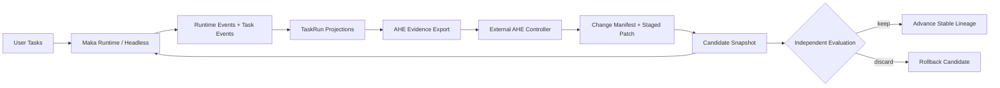
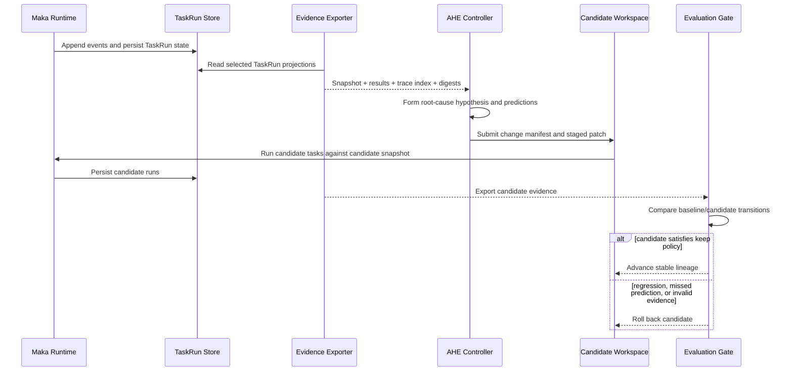

# 第六章：Self-Iteration Happens Outside the Runtime——Maka 的 AHE 演化边界

> 本章回答一个比 Self-check 更大的问题：Maka 如何从多次真实运行中学习，并把经验转化为下一版系统的改进，又不让正在执行任务的 Agent 随意改写自身？Maka 的答案是把自迭代放在交互 Runtime 之外：Runtime 产生不可混淆的运行事实，AHE 消费带身份的 target snapshot 和 evidence，提出受限且可证伪的 change manifest，再由独立评估决定候选改动是否值得保留。**Event Log makes experience replayable; the AHE boundary makes change falsifiable.**

本文承接前五章，但关注的是更外层的时间尺度。Runtime Event Log 记录一次运行，TaskRun projection 组织一个长程任务，Self-check 给当前任务一次受限反馈；AHE 则观察一组运行，尝试改变塑造未来运行的系统组件。

本文面向需要理解或扩展 Maka 自迭代能力的 Runtime、Headless 和评估工程师。它覆盖当前已经存在的 AHE target protocol、evidence export 和 source/patch guards，也解释仓库中 Prompt Optimization Loop 所展示的相邻实现模式。它不声称 Maka 当前会自行启动 AHE、自动应用任意 patch，或已经形成无人监管的通用代码演化系统。

本文包含两类内容：

- **Current**：Maka 已经能够声明 source-backed target surface，从 TaskRun projection 导出带 authority 的结果、trace index、messages 和 failure digest，并验证受限的 change manifest；
- **Target**：由外部 AHE controller 完整执行 snapshot、分析、候选 patch、评估、接受或回滚的闭环，并把每次迭代形成可恢复的 lineage。

## 从“这次任务失败了”到“下一版系统应该不同”

假设 Maka 连续执行十个长程任务，其中四个在相似位置失败：Agent 都能正确理解目标，却在工具失败后过早结束，并且 Self-check 都把不完整结果判断为可接受。

一次普通 Agent Run 只能尝试修复当前任务。一次 Self-check 只能在有限 Turn 内指出当前结果的缺口。真正的系统性问题是：

> 这组失败是否说明 system prompt、tool contract、context policy 或 Headless policy 本身需要改变？

如果直接把全部 trace 交给另一个模型，并允许它修改仓库，会立即产生几个问题：

- 它修改的究竟是哪一版 Maka？
- 哪些文件是允许变化的控制面，哪些是不能改写的证据面？
- “修复了问题”是一个叙述，还是有对应的失败案例和预测？
- 候选改动是否只记住了已见案例？
- 失败是产品行为、评估基础设施故障，还是没有权威分数？
- 改动没有效果或造成回归时，系统如何回到上一条稳定 lineage？

自迭代的难点从来不只是生成一个更好的 prompt 或 patch，而是建立一个可信的实验边界。

## 先说结论：自迭代是外循环，不是 Runtime 递归

Maka 把运行和演化分成两个平面：

| 平面 | 主要职责 | 是否服务当前用户 Turn |
|---|---|---|
| Runtime plane | 执行模型与工具交互，记录事件、权限决策、artifact 和任务状态 | 是 |
| Evolution plane | 汇总多次运行的证据，提出候选改动，比较 baseline 与 candidate | 否 |



从左向右读这张图。上半部分把真实任务转成演化证据，下半部分把一个受限改动重新送入任务执行与评估。图中故意没有把 AHE 放进 Runtime：AHE 不参与正在进行的用户对话，也不拥有 Runtime 的工具权限。

这个边界带来一个重要性质：

> Maka 可以让系统改进自己，但不需要让正在被改进的系统同时担任事实记录者、改动提出者和最终裁判。

## Event Log 在这里从恢复底座变成经验底座

第一章讨论 Runtime Event Log 时，重点是状态空间回放；第三章讨论 Compaction 时，重点是从事实日志生成上下文投影；到了 AHE，日志获得第三种用途：它成为可以跨任务分析的经验来源。

但 AHE 不应该直接吞下一堆没有边界的 JSONL。当前导出链路先经过 TaskRun projection：

```text
Runtime / Task Events
        ↓ project
TaskRunProjection
        ↓ normalize and classify
Harness Results + Trace Index + Messages + Failure Digest
        ↓ bind to
Target Snapshot
```

这不是要用 projection 替代原始事实。Projection 负责提供稳定的任务语义，例如最终状态、artifact、Self-check、workspace observation 和 score authority；需要深挖时，`trace-index.json` 仍然可以指向 `events.jsonl`、transcript、tool result 和 AgentRun message。

因此，AHE 看见的不是一段经过润色的失败总结，而是两层材料：

- **索引和摘要层**：帮助 controller 找到失败类别、Self-check 分歧、最终 workspace 和最近 evidence；
- **原始追踪层**：帮助 controller 回到当时的消息与事件，验证摘要是否遗漏了关键因果链。

这也是 Event Log 架构的重要回报：历史不只可以恢复，还可以被新的 projection 重新解释。

## Target Snapshot：先声明“什么可以被改进”

自迭代系统最危险的默认值是“整个仓库都可以改”。Maka 当前通过 `MakaAheTargetSnapshot` 显式列出 AHE 可理解的组件。

当前 component map 包含：

| Component | Category | 当前可编辑性 |
|---|---|---|
| `maka-system-prompt` | system prompt 与 workspace instructions | 可编辑 |
| `maka-heavy-task-policy` | 长程任务 policy | 可编辑 |
| `maka-tool-contracts` | tool descriptions、schema 与 availability | 可编辑 |
| `maka-context-management` | budget、active prune 与 compaction policy | 可编辑 |
| `maka-permission-policy` | permission 与 pre-tool-use policy | 可编辑 |
| `maka-runtime-evidence` | Runtime Events、AgentRun 与 runner evidence | **只读** |
| `maka-headless-evaluation` | Headless result 与 evaluation policy | 可编辑 |

每个 component 都带有 `sourceRefs`。这让“优化 context management”不再是一句模糊指令，而是被约束到当前协议登记的 source-backed files。

这里最精妙的不是 editable component，而是只读的 `maka-runtime-evidence`：

> 产生判断依据的 ledger 不能同时成为候选 patch 的目标。

否则，系统最容易获得的“提升”不是改善行为，而是改变记分方式、删掉失败记录或让 evidence 对候选更有利。

### Snapshot identity 当前保证了什么

`buildMakaAheTargetSnapshot` 会验证 source refs 存在、位于 repo root 内，并生成稳定 `snapshotId`。当调用方提供 Git repository/ref/commit/dirty identity 时，这些信息也进入 snapshot identity。

需要准确理解当前边界：source file 的内容本身目前不会逐文件进入 `snapshotId` hash；如果调用方没有提供 Git identity，只改变 source 内容并不一定改变 snapshot id。因而生产级外循环应始终携带不可歧义的 commit identity。内容级 fingerprint 属于后续可加强方向，不是当前协议保证。

## Evidence Export：把运行结果转换为保守证据

当前 CLI 提供只读边界：

```sh
maka-headless ahe export <taskRunId...> \
  --store <out>/runs \
  --repo <maka-repo-root> \
  --out <evidence-dir> \
  [--include-events]
```

它读取已有 TaskRun store，而不是重新执行任务；验证 component source refs 后，写出：

| 文件 | 作用 |
|---|---|
| `target-snapshot.json` | 本轮证据属于哪一个 Maka target |
| `harness-results.json` | 每个 task 的标准化状态与 score authority |
| `trace-index.json` | task 到 messages、events、transcript、tool results 和 artifacts 的索引 |
| `traces/<taskRunId>/task-run.json` | 稳定的 TaskRun export |
| `traces/<taskRunId>/messages.json` | 面向 AHE 归一化的模型交互 messages |
| `traces/<taskRunId>/failure-digest.json` | 非成功 cell 的失败摘要、Self-check 分歧与最终状态 |

导出是确定性的：当 snapshot、projection、run id 和 export time 相同，稳定 JSON 输出可以重复生成。这使外层 controller 可以缓存、比较和恢复，而不必把“导出顺序”当成新信息。

### Failure Digest 不是另一段模型总结

`failure-digest.json` 由确定性代码从 TaskRun projection 组织，包含：

- failure taxonomy 与 warnings；
- Self-check 和外部评估之间是否分歧；
- Self-check plan audit、scratch 与 workspace hygiene；
- 最终 artifact、workspace state 和 recent evidence；
- 回到 messages、transcript、events 和评估结果的 debug refs。

它是一种面向演化循环的 projection：压缩查找成本，但保留返回原始记录的路径。

## Authority 必须在学习之前分桶

一个自迭代 controller 如果把所有“pass”都当成同一种信号，很快就会优化错误目标。Maka 当前把结果分为：

- `official_pass` / `official_fail`；
- `infra_failed`；
- `excluded`；
- `self_check_only`；
- `unscored`。

同时记录 `official_verifier`、`official_scorer`、`self_check` 或 `analysis_only` 等 authority。协议明确禁止 Self-check 把结果声明为 official pass/fail。

本章不展开具体评估器实现。架构上重要的是：

> Feedback 可以帮助提出假设，但只有被允许的 authority 才能改变正式成功计数。

这与第五章的结论完全一致。Self-check 是反馈平面；它可以指出失败模式，不能独自成为自迭代的奖励真相。

## Change Manifest：改动必须先成为可证伪假设

AHE 不能只提交一个 diff。当前 `MakaAheChangeManifest` 要求候选改动同时声明：

- 改动了哪些已登记 components；
- 哪些 baseline failure evidence 支持这次修改；
- root cause 是什么；
- targeted fix 是什么；
- 预计修复哪些 task；
- 哪些 task 可能产生风险；
- 使用哪个 validation dataset；
- 满足什么条件必须 rollback。

可以把它理解为一张机器可检查的实验卡：

```text
Observed failure
    + root-cause hypothesis
    + bounded source change
    + predicted wins
    + predicted risks
    + validation set
    + rollback criteria
    = falsifiable candidate
```

Patch 目前只允许 `applyMode: "staged_patch"`。当 `changedFiles` 存在时，每个 path 必须：

- 是 repo-relative POSIX path；
- 不越出仓库；
- 不指向 `.git`、dependency 或 generated `dist` content；
- 属于一个已声明、可编辑 component 的 `sourceRefs`。

验证器还会拒绝改写 `maka-runtime-evidence`，拒绝未知 component，并要求至少一个 failure case、predicted fix、risk case、validation task 和 rollback criterion。

这仍然只是 admission validation，不是 patch executor。当前 Maka 不会因为 manifest 合法就自动应用它，也不会证明 diff 内容本身安全。协议的作用是把任意自修改请求缩小为可以被下一层执行器审查的候选。

## Evaluation：不要只问总分是否上涨

候选改动的结果需要和 baseline 逐 task 比较。`MakaAheChangeEvaluation` 定义的核心不是单个 aggregate score，而是 transition：

| Transition | 含义 |
|---|---|
| `fail_to_pass` | 一个已知失败被候选修复 |
| `fail_to_fail` | 目标失败仍然存在 |
| `pass_to_pass` | 已有能力保持稳定 |
| `pass_to_fail` | 候选造成回归 |
| `new_pass` / `new_fail` | 只在一侧出现的可比较结果 |
| `infra_or_excluded` | 不能进入产品能力结论的 accounting bucket |

Evaluation 还区分 `predictedFixesObserved`、`predictedFixesMissed`、`regressions`、infra、excluded 和 self-check-only task。

这种结构让 controller 不只得到“这轮 72 分”，而能回答：

- 预测修复真的发生了吗？
- 哪些风险预测被验证？
- 是否为了一个目标案例牺牲了原本通过的案例？
- 分数变化是否只是因为更多 cell 被排除或没有计分？

当前协议定义了 evaluation 数据结构，但还没有在同一模块中提供完整的 change-evaluation validator、自动 keep/discard controller 或 AHE runner。这些属于完整闭环的 Target 状态。

## 一次完整自迭代应该怎样流动



从上往下读。当前 Maka 已经实现了左侧的运行事实、TaskRun 持久化和 evidence export，也定义了传给右侧的协议对象。右侧完整的 AHE orchestration、candidate execution 与通用 keep policy 仍属于外部 controller 的职责或未来集成。

## 相邻的 Current 实现：Prompt Optimization Loop

仓库中的 `prompt-optimization-loop.ts` 展示了一套更窄但已经可执行的自迭代循环。它不是当前 AHE target protocol 的执行器，也没有消费 `change-manifest.json`；它专门优化 system prompt。但它验证了几条同样重要的设计原则：

1. 先多次运行 baseline，估计噪声带；
2. 把任务分成 held-in 与 held-out；
3. Meta-agent 只能看到 held-in feedback，controller-only artifacts 位于 Agent workspace 外；
4. 每个 prompt candidate 先成为 Git commit；
5. held-in 没有超过噪声或触发 reward-hack quarantine 时，不浪费 held-out sweep；
6. acceptance policy 只能 `keep` 或 `discard`；
7. discard 会 rollback candidate commit；
8. 所有 sweep、candidate 和 decision 写入 WAL，可以 replay 和 resume；
9. cost ceiling、infra failure rate 和 round count 给循环设置硬边界。

它和 AHE 的关系更适合这样理解：

| AHE target protocol | Prompt Optimization Loop |
|---|---|
| 通用的 Maka 演化边界 | 专项的 system-prompt 优化器 |
| 描述 components、evidence、manifest 与 evaluation | 实际执行 baseline、candidate、keep/discard |
| 可覆盖多个 source-backed control surfaces | 强制只修改 system prompt |
| 当前依赖外部 controller 完成闭环 | 当前已有内部 controller 和 WAL replay |

未来两者可能共享 snapshot identity、evidence taxonomy、candidate lineage 和 acceptance primitives，但当前不应把它们描述成一条已经接通的调用链。

## 三条必须保持的不变量

### 1. Evidence plane 不能被 candidate 改写

候选可以改变 prompt、tool contract 或 context policy，但不能通过同一 patch 改写作为 baseline/candidate 比较依据的 Runtime evidence ledger。

### 2. 每个结果必须绑定 target identity

`MakaAheRunResult` 同时带 `runId`、`snapshotId` 和 `taskId`。没有 target identity 的分数不能安全地进入跨版本比较。

### 3. 没有反例集合，就没有可接受的自迭代

Change manifest 必须包含 risk cases 和 rollback criteria；candidate evaluation 必须保留 `pass_to_fail`。只证明目标失败变好，而不观察已有能力，是定向过拟合，不是系统改进。

可以把完整边界概括为：

```text
Immutable evidence
  + versioned target
  + bounded editable surface
  + falsifiable prediction
  + independent comparison
  + reversible lineage
  = controlled self-iteration
```

## 失败与恢复：外循环也必须是 Durable Loop

### 导出失败

Source ref 缺失、越界或 component map 非法时，snapshot 构建失败；TaskRun 不会因此被修改。调用方可以修正 repo identity 或 component registration 后重新导出。

### 只有 Self-check，没有正式结果

该 cell 被归入 `self_check_only` 或 `unscored`，而不是伪装为成功。AHE 仍可把它当作分析材料，但不能据此确认 candidate improvement。

### Candidate patch 不满足 manifest

当前 validator 会拒绝未知 component、evidence-only target、危险路径和缺少可证伪字段的 manifest。由于 validator 不负责应用 diff，不会产生半应用状态。

### Candidate 执行中断

通用 AHE runner 尚未在当前协议模块实现。Target 设计应像 Headless 与 Prompt Optimization Loop 一样记录 append-only iteration WAL，使 snapshot、candidate commit、已完成 cells 和 decision 能够恢复，而不是靠扫描目录猜测进度。

### Evaluation 不完整

Infra、excluded、unscored 和 missing cells 应保持独立。一个完整 keep policy 不能把“没有观察到回归”误当成“证明没有回归”。必要时应保持 candidate pending 或 discard，而不是自动提升 lineage。

## 为什么不把 AHE 直接做成 Runtime Tool

把 `improve_yourself` 暴露成普通 Tool 看起来更直接，但会混合几个本应分开的权限：

- 当前任务 Agent 会同时接触用户 workspace 和 Maka source workspace；
- 正在运行的版本会决定怎样修改自己的评估与 evidence；
- 一个 Turn 的 token、timeout 和取消语义要承担跨任务实验；
- 用户任务失败可能直接触发 repository mutation；
- 恢复一次 Session 将不得不恢复一条代码版本 lineage。

外循环增加了协议和 artifact 成本，却换来更清晰的 authority、隔离和时间尺度。只有当 Maka 能证明 in-Runtime mutation 具有同等隔离和可恢复性时，才值得重新考虑这个边界。

## 当前限制与 Target 方向

### Current：已经可以依赖的事实

- AHE target protocol 使用版本号 `maka.ahe-target.v1`；
- current component map 是 source-backed 的，并区分 editable 与 evidence-only；
- evidence export 是只读操作，消费 TaskRun projection；
- 结果按 authority 和 accounting status 保守分桶；
- trace index 可以连接 messages、events、transcript、tool results 和 artifacts；
- failure digest 暴露 Self-check divergence、hygiene 和最终状态；
- change manifest validator 限制 component、path 与最小实验声明；
- CLI 可以导出 baseline evidence，但不会运行 AHE 或应用 patch。

### Target：形成闭环仍需要的能力

- 内容寻址或强制 Git commit 的 snapshot identity；
- `change-manifest.json` 与实际 diff 的完整 hash binding；
- 通用 candidate workspace、patch executor 和 sandbox policy；
- change evaluation validator 与明确的 keep/discard policy；
- iteration WAL、resume fingerprint 和 lineage state；
- dataset version、partition policy 与数据泄漏防护；
- cost、round、concurrency 和 regression budget；
- 将 candidate decision 作为可审计事件写回演化 ledger；
- 在不污染 Runtime canonical log 的前提下，关联演化 lineage 与生产版本。

这些方向不意味着目标是让 Maka 无限制地修改所有代码。更成熟的自迭代反而应该拥有更小的 change surface、更强的证据绑定和更明确的停止条件。

## 代码地图

| 关注点 | 当前入口 |
|---|---|
| AHE protocol types 与 validators | `packages/headless/src/ahe-target-protocol.ts` |
| Target snapshot 与 evidence export | `packages/headless/src/ahe-evidence-export.ts` |
| CLI `ahe export` | `packages/headless/src/cli.ts` |
| TaskRun export 与 event projection | `packages/headless/src/result-export.ts`、`task-run-store.ts` |
| AHE protocol tests | `packages/headless/src/__tests__/ahe-target-protocol.test.ts` |
| Evidence export tests | `packages/headless/src/__tests__/ahe-evidence-export.test.ts` |
| 专项 Prompt Optimization Loop | `packages/headless/src/prompt-optimization-loop.ts` |
| Candidate isolation 与 Git lineage | `packages/headless/src/prompt-candidate-loop.ts` |
| Noise-aware keep/discard policy | `packages/headless/src/prompt-acceptance-policy.ts` |
| Optimization WAL 与 resume | `packages/headless/src/fixed-prompt-controller.ts`、`prompt-optimization-replay.ts` |

## 结语：自迭代不是自我相信，而是可重复的反驳过程

Maka 的 AHE 集成最值得保留的思想，不是“让一个更强的模型改 prompt”，而是把系统改进组织成一条有版本、有证据、有预测、有反例、有回滚的外循环。

Event Log 记录系统经历了什么；TaskRun projection 把经历组织成任务事实；AHE target protocol 声明哪些控制面可以改变；change manifest 把改动变成可证伪假设；evaluation transition 决定假设是否经得住新的运行。

所以 Maka 的自迭代不应该被描述为 Agent 在运行中突然变聪明。更准确的说法是：

> **Maka preserves experience as evidence, then lets a separate evolution loop earn every change.**
